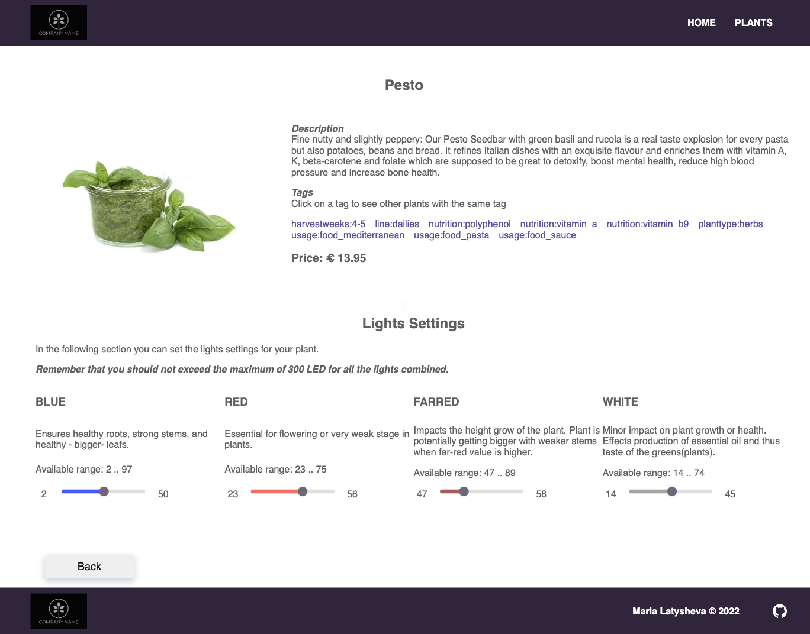
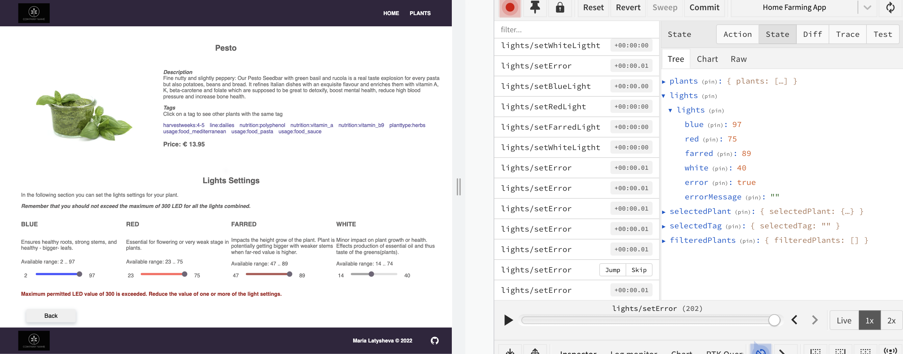
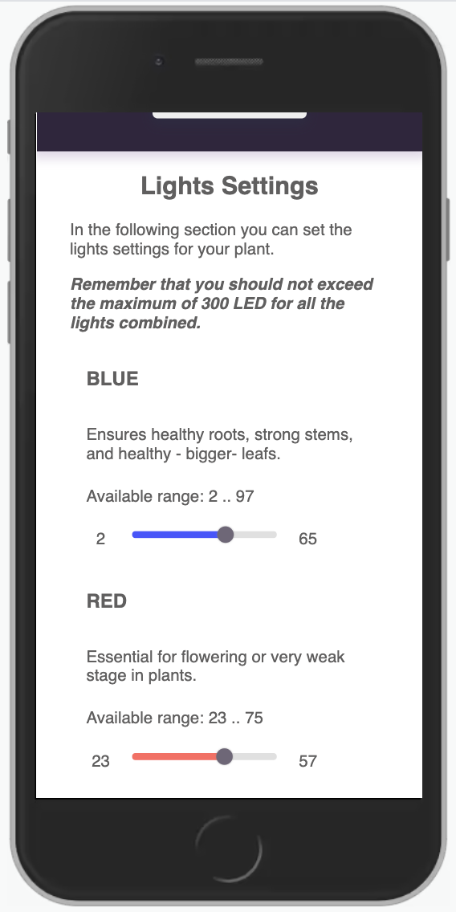

# Home Farming App
This is a sample SPA that fetches plants from an external API. This app represents a user interface for users to get information about specific plants and modify light settings necessary to grow the plants at home.  
There is a plage that shows available plants. The user can select a particular plant to view details and to set light settings. 
There are light setting inputs for each plant and a list of tags. The user can filter available plants by a given tag and the list of the filtered plants will be monted into the current plant page

## Deployed app
The deployed app is hosted on GitHub pages here:
 
https://mlatysheva.github.io/home_farming_app 

## Implemented functionality
- The data is retrieved from an extermal API dynamically (the initial data is loaded from the json file contained within this repository)
- The UI implements the following features:
	- There is a list of all available plants
	- The user can select a specific plant
	- The selected plant is opened in a seperated route: /plants/:id.
  - The selected plant page provides the following functionality:
		- It showcases the features of the plant
		- Guides the user through the effects of different colors
		- Lets the user select a light intensity for each color that lies within the intensity range specified for this plant (e.g. "blue": [30, 100] means that the minimum intensity is 30% and the maximum intensity is 100%)
		- Ensures that the overall light value (all colours added up) does not exceed 300%
    - Enables the user to filter all plants by a given tag from the selected plant page. The list of the filtered plants is mounted in the selected plant page and the user can click on another plant in the filtered list, which will be opened in a separate route page
    - There is a search by tag functionality, whereby the user can click on a tag on the plant specific page and see a list with all available plants that have the same tag, mounted into the selected plant page
- Different urls based on the id are used for each selected plant
- Responsive design is implemented

## Stack used:
- Typescript
- React
- Redux: to store the information about the plants, the selected plant and its current light settings, as well as the selected tag and the plants filtered by the given tag
- SCSS
- axios: to fetch the data from the external API

## Installation and usage

1. Clone the repository to your local machine by running `git clone https://github.com/mlatysheva/home_farming_app.git` from your terminal
2. `cd` into the cloned repository
3. Run `npm install` from the terminal to install all the dependencies
4. Run `npm run start` to start the app in the development mode.\
Open [http://localhost:3000](http://localhost:3000) to view it in the browser.
The page will reload if you make edits.\
You will also see any lint errors in the console.
5. Run `npm run build` to build the app for production to the `build` folder.\
The build is minified and the filenames include the hashes.\

## Functionality

- The app has `/`, `/*`, `/plants` and `/plants/:id` routes and corresponding pages rendered as an SPA
- The `/plants` page displays the list of available plants with the information kept and updated in the Redux store:
 

 

- The `/plants:id' page displays the characteristics of the selected plant, a section where the user can click on a tag to see all plants with the given tag and a section where the user can change the LED settings. The information about the selected plant and its LED settings, as well as the selected tag and filtered plants is kept and updated in the Redux store:
 

 

- The list of the tags is interactive. If the user clicks on a tag, a list with the corresponding plants will be mounted into the selected plant page with the information kept in the Redux store:
 

 

- If the total LED settings exceed 300, the user will be prompted to reduce the LED settings for other lights before increasing them for the desired light:
 

 

- Responsive design is provided:
 

