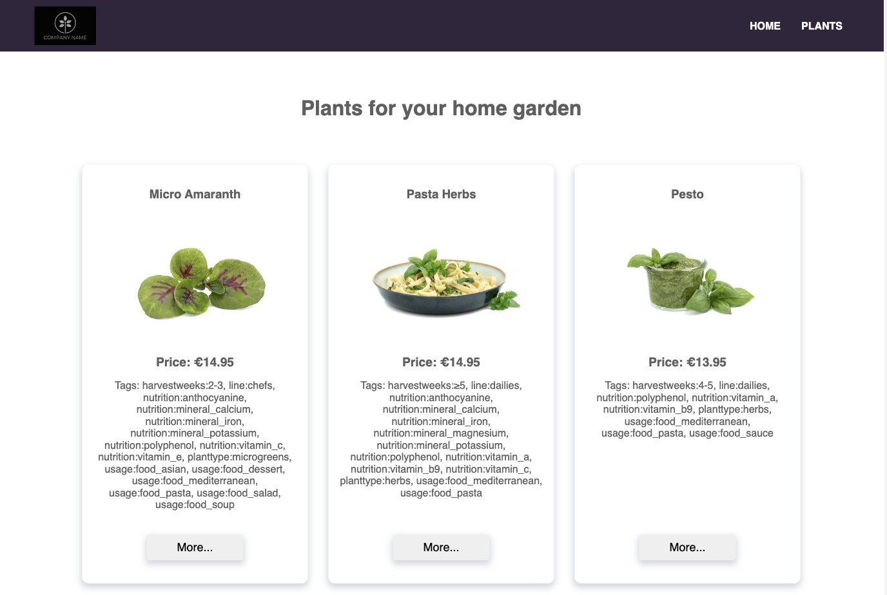

# Description:
This is an SPA created to pass a coding challenge of Agrilution, a company that builds vertical farming devices with which a customer can grow plants. This app represents a user interface for users to get information about specific plants and modify the led intensity.
This app includes a special LED allowing to adjust the color spectrum of the light individually. 
The various color types have certain effects on the plants, however each plant requires a different mix of color spectrum, and expects a certain min and max range on the spectrum intensity. 
<br>
The colors are:
- blue
- white
- red
- far-red

## API Endpoint 

The following api endpoint was used for this app:

Secured:
https://dev.api.agrilution.com/plantData.json

The endpoint returns an object with different fields. An example and explanation of these fields is shown below:

Example:
```json
"some_id": {
	"title": "Kale",
	"description": "abc",
	"images": ["url"],
	"light_settings": {
		"blue": [33, 74],
		"farred": [13, 94],
		"red": [3, 78],
		"white": [2, 79]
	},
	"price": "9.95",
	"tags": ["harvestweeks:3-4", "line:essentials"]
}
```

Explanation:
```
some_id = a unique id for each plant
title = the english title of the plant
description = a description for the plant
images = urls pointing to one or more images of the plant
light_settings = the range of light settings allowed in %. In this example, the plant can handle any blue light intensity between 33 and 74% 
price = the price for the plant in euros
tags = a list of tags which describe the plants
```

## Implemented functionality
- The data is retrieved from the above endpoint dynamically (the initial data is loaded from the json file within this repository)
- The UI implements the following features:
	- Lists all available plants
	- Selects a specific plant
	- Has a seperated page for the above selected plant that:
		- Showcases its features
		- Guides the user through the effects of the different colors
		- Lets the user select a light intensity for each color that lies within the intensity range specified for this plant (e.g. "blue": [30, 100] means that the minimum intensity is 30% and the maximum intensity is 100%)
		- Ensures that the overall light value (all colours added up) does not exceed 300%

## Bonus Tasks implemented:
- Different urls based on the id are used for each plant
- Creative UIs and responsive design are used
- SCSS is used

## Stack used:
- Typescript
- React
- Redux: to store the information about the plants, the selected plant and the current light settings for the selected plant
- SCSS
- axios: to fetch the data from the external API

## Installation and usage

1. Clone the repository to your local machine by running `git clone https://mlatysheva@bitbucket.org/agrilution-os/frontend_ws_latysheva.git` from your terminal
2. `cd` into the cloned repository
3. Run `npm install` from the terminal to install all the dependencies
4. Run `npm run start` to start the app in the development mode.\
Open [http://localhost:3000](http://localhost:3000) to view it in the browser.

The page will reload if you make edits.\
You will also see any lint errors in the console.
5. Run `npm run build` to build the app for production to the `build` folder.\
The build is minified and the filenames include the hashes.\

## Functionality

- The app has `/`, `/*`, `/plants` and `/plants/:id` routes and corresponding pages rendered as an SPA
- The `/plants` page displays the list of available plants with the information kept and updated in the Redux store




- The `/plants:id' page displays the characteristics of the selected plant and a section where the user can change the LED settings, the information about the selected plant and its LED settings is kept and updated in the Redux store


- If the total LED settings exceed 300, the user will be prompted to reduce the LED settings for other lights before increasing them for the desired light:


- Responsive design is provided:


